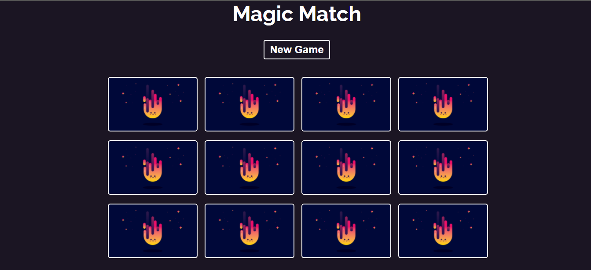
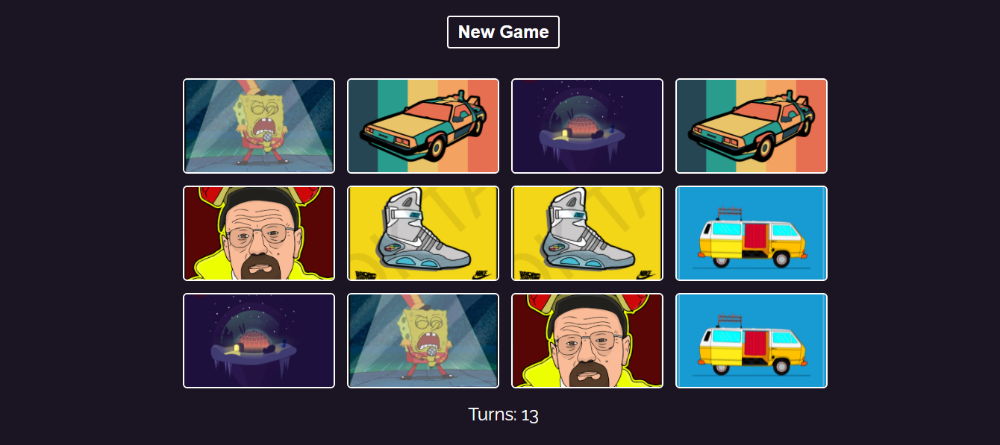

# Memory Magic

Live project link: [https://theakshaymore.github.io/Magic-Match/](https://theakshaymore.github.io/Magic-Match/).

Memory Check Game is a simple project developed using ReactJs, HTML5, CSS, and JavaScript. This game is about testing your short term memory skills. A series of images will appear in a box shape area while playing this game. The player has to find the two same images and click on them to make them disappear.

## Features of the Game:

- The Memory Check Game project is simply in HTML, CSS, and JavaScript.
- The user has to click the two same images to make them disappear.
- The images are below the lock cover image.
- You just have to use your cursor to click the images according to the requirements.

## How To Run the Project?

- Clone this repository into your local machine
  - git clone https://github.com/theakshaymore/Magic-Match.git
- In the root of project directory, run following commands:
  - npm install
  - npm start

## Screenshots

